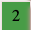
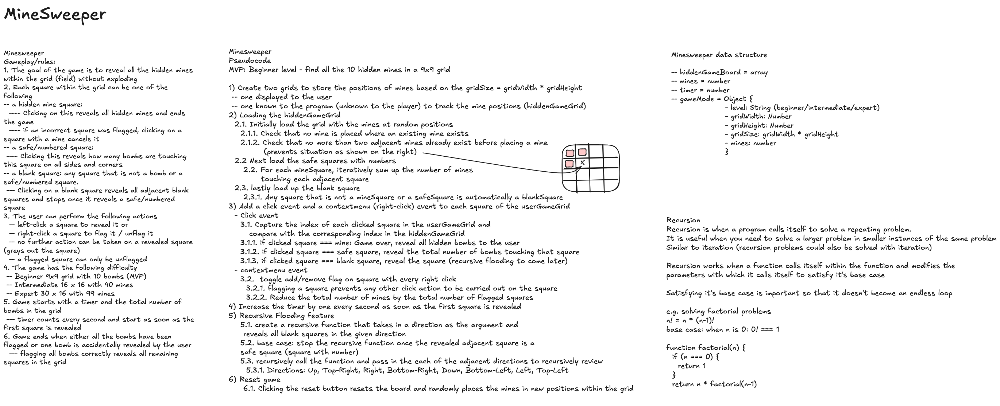
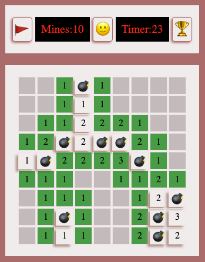
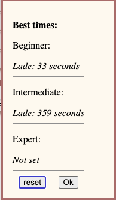

### General Assembly Software Engineering Immersive

# Project 1 - Minesweeper

  

## Description

Minesweeper is a game where mines are hidden in a grid of squares.

Each square within the grid is either a safe square  , a blank square  or a mine .

Safe squares have numbers telling you how many mines touch the square. You can use the number clues to solve the game by opening all of the safe squares. If you click on a mine you lose the game!

**To win, you must correctly flag  all the mines in the grid!**

You can learn to play Minesweeper following this link: [How to play Minesweeper](https://minesweepergame.com/strategy/how-to-play-minesweeper.php)

Play the game here: [Minesweeper ](https://ladeoshodi.github.io/minesweeper/)


### The Brief

- Render the game in the browser using JavaScript for DOM manipulation
- Include win/loss logic and render win/loss messages in HTML. The game you chose **_must_** have a win/lose condition.
- Include separate HTML, CSS, JavaScript, and JavaScript data files organized in an appropriate directory structure.
- Include all required features specific to your game. For Minesweeper, **_recursive flooding_** is the required feature.
- Deploy the game online so that the rest of the world can play it.

### Technologies used

- HTML
- CSS
- JavaScript
- Git & Github

---

## Building the Game

Minesweeper is a classic windows game that requires correctly locating where all the mines are on the board. The game has three main difficultly modes:

- Easy/Beginner: 8x8 or 9x9 grid with 10 mines
- Medium/Intermediate: 16x16 grid with 40 mines
- Hard/Expert: 30x16 grid with 99 mines

I chose the Minesweeper project to deepen my knowledge of recursion

### Approach

This was a solo project. To develop the game, I broke it down into various logical pieces:

1. Generate two grids:
   - one available to the player to track the grid cell they select.
   - a hidden grid hidden to the player to store the location of all mine, safe and blank squares to compare with the user selection.
2. Pre-load the hidden grid with the position of all the mines, blank and safe squares at the start of every new game.
   - Initially load the hidden grid with blank squares.
   - Next, randomly position the mines within the hidden grid. Check that a mine is not placed where one previously exists.
   - Determine the safe squares by checking and counting the number of squares with mines surrounding it.
3. Add click-events listeners to each cell to capture "left" and "right" clicks within the grid
   - a left click will reveal the square which could either be a blank, safe or mine square.
   - a right click flags a square and prevents any further "left" click action on it
4. Implement the recursive flooding algorithm to recursively reveal all adjacent blank squares when one blank square is reveal


_Minesweeper whiteboard_

#### Generating the Grid

In order to allow for various board sizes to be generated depending on the difficulty, a JS object was used to store the each grid property, such as the grid width and size, appropriate to the level.

```javascript
const gameMode = {
  beginner: {
    level: "beginner",
    gridWidth: 9,
    gridLength: 9,
    mines: 10,
    get gridSize() {
      return this.gridWidth * this.gridLength;
    },
  },
  intermediate: {
    level: "intermediate",
    gridWidth: 16,
    gridLength: 16,
    mines: 40,
    get gridSize() {
      return this.gridWidth * this.gridLength;
    },
  },
  expert: {
    level: "expert",
    gridWidth: 30,
    gridLength: 16,
    mines: 99,
    get gridSize() {
      return this.gridWidth * this.gridLength;
    },
  },
};
```

Each Grid is then generated by iteratively looping through the grid size and generating a div (cell) to be appended to the DOM

```javascript
for (let i = 0; i < gameMode[level].gridSize; i++) {
  const cell = document.createElement("div");
  cell.classList.add("cell");
  cell.dataset.index = i;
  cell.addEventListener("click", handleClick);
  cell.addEventListener("contextmenu", flagCell);
  gameBoard.push(cell);
  gridEl.appendChild(cell);
}
```

#### Pre-loading the hidden grid

To kick start the game, the hidden grid is loaded in three steps

1. the blank squares are initially loaded
2. next, the mine are then randomly loaded
3. Lastly, the bombs are counted and stored in each adjacent cell


_Loaded Minesweeper_

To count each adjacent bomb, we loop through each square and count the total number of bombs in all directions of that square

```javascript
// count adjacent bombs
gameBoardHidden.forEach((cell, index, arr) => {
  if (cell !== minesweeper.mine && countAdjacentMines(level, index)) {
    arr[index] = countAdjacentMines(level, index);
  }
});

function countAdjacentMines(level, startPos) {
  let mineCount = 0;
  let newPosition;
  // count top
  if (canMoveToTop(startPos, gameMode[level].gridWidth)) {
    newPosition = startPos - gameMode[level].gridWidth;
    if (gameBoardHidden[newPosition] === minesweeper.mine) {
      mineCount += 1;
    }
  }
  // count top right
  if (canMoveToTopRight(startPos, gameMode[level].gridWidth)) {
    newPosition = startPos + 1 - gameMode[level].gridWidth;
    if (gameBoardHidden[newPosition] === minesweeper.mine) {
      mineCount += 1;
    }
  }
  // count right
  if (canMoveToRight(startPos, gameMode[level].gridWidth)) {
    newPosition = startPos + 1;
    if (gameBoardHidden[newPosition] === minesweeper.mine) {
      mineCount += 1;
    }
  }
  // count bottom right
  if (
    canMoveToBottomRight(
      startPos,
      gameMode[level].gridWidth,
      gameMode[level].gridSize
    )
  ) {
    newPosition = startPos + gameMode[level].gridWidth + 1;
    if (gameBoardHidden[newPosition] === minesweeper.mine) {
      mineCount += 1;
    }
  }
  // count bottom
  if (
    canMoveToBottom(
      startPos,
      gameMode[level].gridWidth,
      gameMode[level].gridSize
    )
  ) {
    newPosition = startPos + gameMode[level].gridWidth;
    if (gameBoardHidden[newPosition] === minesweeper.mine) {
      mineCount += 1;
    }
  }
  // count bottom left
  if (
    canMoveToBottomLeft(
      startPos,
      gameMode[level].gridWidth,
      gameMode[level].gridSize
    )
  ) {
    newPosition = startPos - 1 + gameMode[level].gridWidth;
    if (gameBoardHidden[newPosition] === minesweeper.mine) {
      mineCount += 1;
    }
  }
  // count left
  if (canMoveToLeft(startPos, gameMode[level].gridWidth)) {
    newPosition = startPos - 1;
    if (gameBoardHidden[newPosition] === minesweeper.mine) {
      mineCount += 1;
    }
  }
  // count top left
  if (canMoveToTopLeft(startPos, gameMode[level].gridWidth)) {
    newPosition = startPos - gameMode[level].gridWidth - 1;
    if (gameBoardHidden[newPosition] === minesweeper.mine) {
      mineCount += 1;
    }
  }
  return mineCount;
}
```

#### Recursion

This was the biggest challenge within the game as the logic has to travel in all directions from the origin point, reveal each adjacent blank square as it travels and stop the recursion in that direction when it reaches a safe square.

The algorithm to achieve this is as follows (pseudocode):

```pseudocode
1. Reveal the starting square if it is blank (i.e. no adjacent bombs) and if it has not been previously revealed.
2. Traverse in all 8 directions of the square as long as it's not at the edge of the grid changing the starting square position and repeating step 1
3. If the conditions for step 1 fails, reveal the square and end the recursive loop
```

```javascript
function revealAdjacentBlankSquares(level, startPos) {
  if (
    !countAdjacentMines(level, startPos) &&
    !gameBoard[startPos].classList.contains("revealed")
  ) {
    revealSquare(startPos);
    if (canMoveToTop(startPos, gameMode[level].gridWidth)) {
      revealAdjacentBlankSquares(level, startPos - gameMode[level].gridWidth);
    }
    if (canMoveToRight(startPos, gameMode[level].gridWidth)) {
      revealAdjacentBlankSquares(level, startPos + 1);
    }
    if (canMoveToLeft(startPos, gameMode[level].gridWidth)) {
      revealAdjacentBlankSquares(level, startPos - 1);
    }
    if (
      canMoveToBottom(
        startPos,
        gameMode[level].gridWidth,
        gameMode[level].gridSize
      )
    ) {
      revealAdjacentBlankSquares(level, startPos + gameMode[level].gridWidth);
    }
    if (canMoveToTopRight(startPos, gameMode[level].gridWidth)) {
      revealAdjacentBlankSquares(
        level,
        startPos + 1 - gameMode[level].gridWidth
      );
    }
    if (
      canMoveToBottomRight(
        startPos,
        gameMode[level].gridWidth,
        gameMode[level].gridSize
      )
    ) {
      revealAdjacentBlankSquares(
        level,
        startPos + gameMode[level].gridWidth + 1
      );
    }
    if (canMoveToTopLeft(startPos, gameMode[level].gridWidth)) {
      revealAdjacentBlankSquares(
        level,
        startPos - gameMode[level].gridWidth - 1
      );
    }
    if (
      canMoveToBottomLeft(
        startPos,
        gameMode[level].gridWidth,
        gameMode[level].gridSize
      )
    ) {
      revealAdjacentBlankSquares(
        level,
        startPos - 1 + gameMode[level].gridWidth
      );
    }
  } else {
    revealSquare(startPos);
  }
}
```

---

## Additional Components

### Flagging the board

Flagging is an important of the game as the hidden mines need to be correctly flagged to win the game.
Using the "contextmenu" click event, I was able to capture a right click to flag the target cell

```javascript
cell.addEventListener("contextmenu", flagCell);

function flagCell(e) {
  e.preventDefault();
  startTimer();
  const cellIndex = e.target.dataset.index;
  const level = gridEl.dataset.level;
  if (!gameBoard[cellIndex].classList.contains("revealed")) {
    if (!gameBoard[cellIndex].classList.contains("flag")) {
      if (flaggedMines < gameMode[level].mines) {
        gameBoard[cellIndex].classList.add("flag");
        gameBoard[cellIndex].textContent = minesweeper.flag;
        flaggedMines += 1;
      }
    } else {
      gameBoard[cellIndex].classList.remove("flag");
      gameBoard[cellIndex].textContent = "";
      flaggedMines -= 1;
    }
    mineCountDisplay.textContent = gameMode[level].mines - flaggedMines;
  }
}
```

### Click to flag (mobile friendly)

To work around the limitation of accessing a "right-click" on mobile devices, I implemented a `clickToFlag` flag that when true interprets all clicks/taps/touches to a right-click.

```javascript
const clickToFlagBtn = document.querySelector(".click-to-flag");
let clickToFlag = false;

clickToFlagBtn.addEventListener("click", (e) => {
  e.target.classList.toggle("active-flag");
  clickToFlag = clickToFlag ? false : true;
});

function handleClick(e) {
  if (clickToFlag) {
    flagCell(e);
  } else {
    revealCell(e);
  }
}
```

### Tracking high scores

I used the browser local storage to keep track of the player's high scores which is the shortest amount of time the player took to win the game for each level


_high scores_

---

## In conclusion

### Key Learnings/Takeaway

This project has enabled me to solidify my knowledge of recursion especially thinking through the base case to prevent infinite loops and call stack range errors.
I also got to practice good design in how I styled and visually structured the project with CSS and HTML.

### Future Features

Improvements to be added to the project

1. Color-coding the different safe numbers
   e.g.
   - 1 - blue
   - 2 - green
   - 3 - red e.t.c
2. Centering the highscore and win message modal/dialog boxes
3. Vertically centering the entire minesweeper board on longer screens
4. Adding a background image to improve the look and feel of the game
