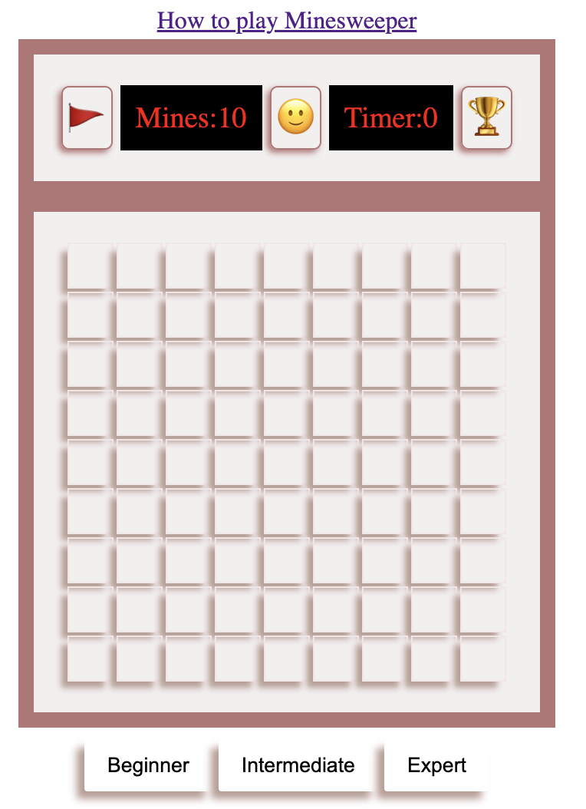

# Minesweeper

#### Description

Minesweeper is a game where mines are hidden in a grid of squares. Safe squares have numbers telling you how many mines touch the square. You can use the number clues to solve the game by opening all of the safe squares. If you click on a mine you lose the game!

**To win, you must correctly flag all the mines in the grid!**

[How to play Minesweeper](https://minesweepergame.com/strategy/how-to-play-minesweeper.php)

[Click to play game live](https://ladeoshodi.github.io/minesweeper/)

#### Technologies used

- HTML
- CSS
- JavaScript
